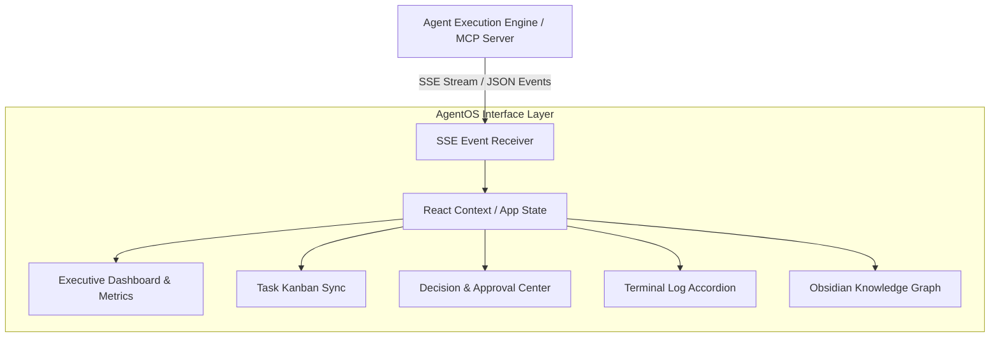

<p align="center">
  
</p>

# AgentOS — AI Agent Control Dashboard & Orchestration Framework

[](https://github.com/jd5073356-max/AgentOS)
[](https://nextjs.org)
[](https://typescriptlang.org)
[](https://tailwindcss.com)
[](https://developer.mozilla.org/en-US/docs/Web/API/Server-sent_events)

> **Centro de Operaciones para Agentes de Inteligencia Artificial.** Dashboard interactivo de alto rendimiento diseñado para monitorear, orquestar y visualizar la ejecución distribuida de agentes autónomos en tiempo real.

---

## 🎯 ¿Por qué existe AgentOS? (La Problemática)

A medida que los sistemas de inteligencia artificial evolucionan hacia enjambres de múltiples agentes (desarrolladores, investigadores, planificadores, auditores), **la supervisión humana se convierte en un cuello de botella por la falta de observabilidad:**
1. **Opacidad en la ejecución:** Imposibilidad de ver qué herramienta o comando está ejecutando un subagente en tiempo real.
2. **Desconexión entre estado y tareas:** La información de las tareas se pierde en archivos de log extensos sin una estructura visual de Kanban o tablero de decisiones.
3. **Control de contexto ineficiente:** Dificultad para inspeccionar la memoria y las habilidades cargadas por cada agente durante su Trajectory.

---

## ⚡ ¿Para qué sirve? (El Propósito y Valor)

AgentOS proporciona una **interfaz de control estilo Cyberpunk / Mission Control** que brinda visibilidad total a los ingenieros de software sobre el ciclo de vida completo de sus enjambres de IA:

### Capacidades Principales:
- **Transmisión de Eventos SSE en Tiempo Real:** Monitor de flujo directo que recibe notificaciones de inicio de tareas, invocaciones de herramientas y estados de finalización.
- **Tablero Kanban de Misiones:** Sincronización automática de tareas (`Backlog`, `In Progress`, `Completed`) clasificadas por agente responsable.
- **Inspector Universal & Grafos de Conocimiento:** Exploración visual de nodos de memoria (`ObsidianGraph`) y vista previa de archivos modificados por los agentes.
- **Librería de Habilidades y Replay Simulator:** Simulador de reproducciones para auditar trajinetas de ejecución anteriores y verificar la validez de los resultados.

---

## 🏗️ Arquitectura del Sistema Frontend



---

## 🧩 Componentes Principales

| Componente | Función Principal |
|---|---|
| `ExecutiveDashboard.tsx` | Vista general con métricas de salud, agentes activos y latencia. |
| `DecisionCenter.tsx` | Panel interactivo para aprobación de decisiones críticas de agentes. |
| `AgentLibrary.tsx` | Catálogo de capacidades, modelos asignados y parámetros de sistema. |
| `ObsidianGraph.tsx` | Renderizado de nodos de memoria compartida entre agentes. |
| `UniversalInspector.tsx` | Visor de archivos y diffs de código generados en tiempo real. |

---

## 🛠️ Stack Tecnológico

- **Framework Core:** Next.js, React 19, TypeScript.
- **Estilos & UI:** Tailwind CSS, Lucide React Icons.
- **Build Tool:** Vite, PostCSS.
- **Realtime:** EventSource Server-Sent Events (SSE), WebSockets.

---

## 🚀 Instalación y Uso Rápido

```bash
# 1. Clonar el repositorio
git clone https://github.com/jd5073356-max/AgentOS.git
cd AgentOS

# 2. Instalar dependencias
npm install

# 3. Compilar para producción
npm run build

# 4. Servir localmente
npm run dev
```

---

## 👤 Autor

**Juan David Herrera**  
*AI Automation Engineer | Product Engineer · AI, Systems & Web3*  
Bogotá, Colombia  
- **GitHub:** [@jd5073356-max](https://github.com/jd5073356-max)  
- **LinkedIn:** [linkedin.com/in/juan-david-herrera](https://linkedin.com)
