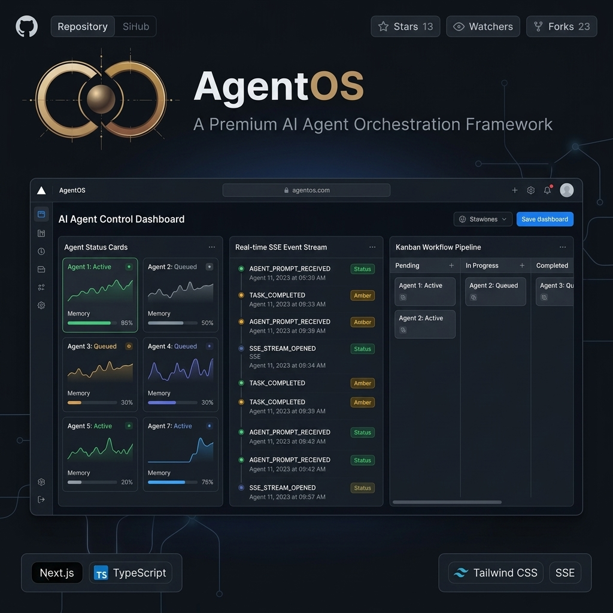

  

# AgentOS — AI Agent Control Dashboard & Orchestration Framework

Dashboard interactivo de alto rendimiento para el monitoreo y la orquestación de agentes de IA autónomos en tiempo real. 

- **Características:** Transmisión de eventos SSE en tiempo real, tarjetas de estado de agentes, pipeline Kanban de tareas, visualizadores de habilidades y acordeón de logs.
- **Stack:** Next.js, React, TypeScript, Tailwind CSS, Lucide Icons, SSE.
